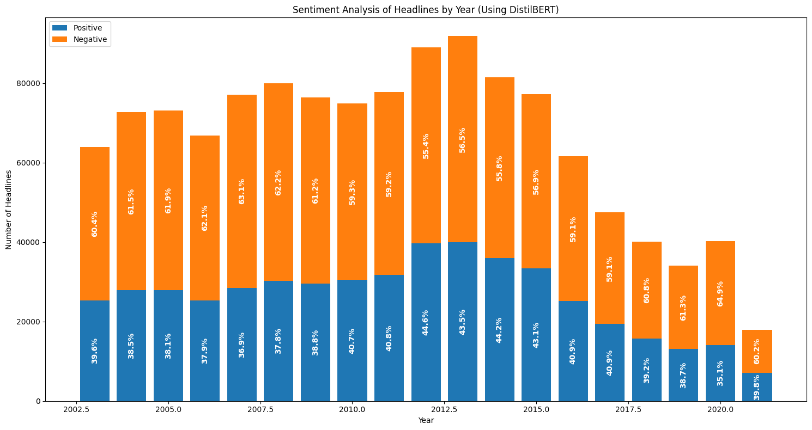

# Analyze Headline Sentiment Over Time (DistilBERT)

This Jupyter Notebook explores sentiment trends in news headlines using DistilBERT. It performs sentiment analysis on headlines from 'abcnews-date-text.csv' and visualizes positive and negative sentiment distribution across years.

## Installation

**Prerequisites:**

- Python 3.x (check with `python --version`)
- Necessary libraries (`pandas`, `matplotlib`, `transformers`, `tqdm`) can be installed using `pip install pandas matplotlib transformers tqdm`

## Usage

1. Download the `abcnews-date-text.csv` dataset and place it in the same directory as this notebook.
2. Run all code cells (in order) by pressing `Shift+Enter`. The notebook performs the following steps:
   - Imports required libraries.
   - Loads the CSV data using `pandas.read_csv`.
   - Preprocesses data (date conversion, year extraction).
   - Loads the DistilBERT model and tokenizer.
   - Defines a function `process_batches` for efficient sentiment prediction on text batches.
   - Computes sentiment scores for headlines using the pre-trained model.
   - Creates a DataFrame to store sentiment scores by year.
   - Calculates negative sentiment by subtracting positive counts from total counts.
   - Generates a bar chart depicting positive and negative sentiment trends over years.
   - (Optional) Adds percentage labels to bars for clarity.

## Output

The notebook generates a bar chart visualizing the distribution of positive and negative sentiment in headlines for each year.

## Additional Notes

- This code demonstrates basic sentiment analysis using DistilBERT. For more advanced tasks, explore fine-tuning DistilBERT on a specific sentiment dataset.
- Consider using a GPU for faster computations.
- Explore other pre-trained models or training your own model for sentiment analysis.
- Customize the code to analyze different datasets or sentiment categories.
